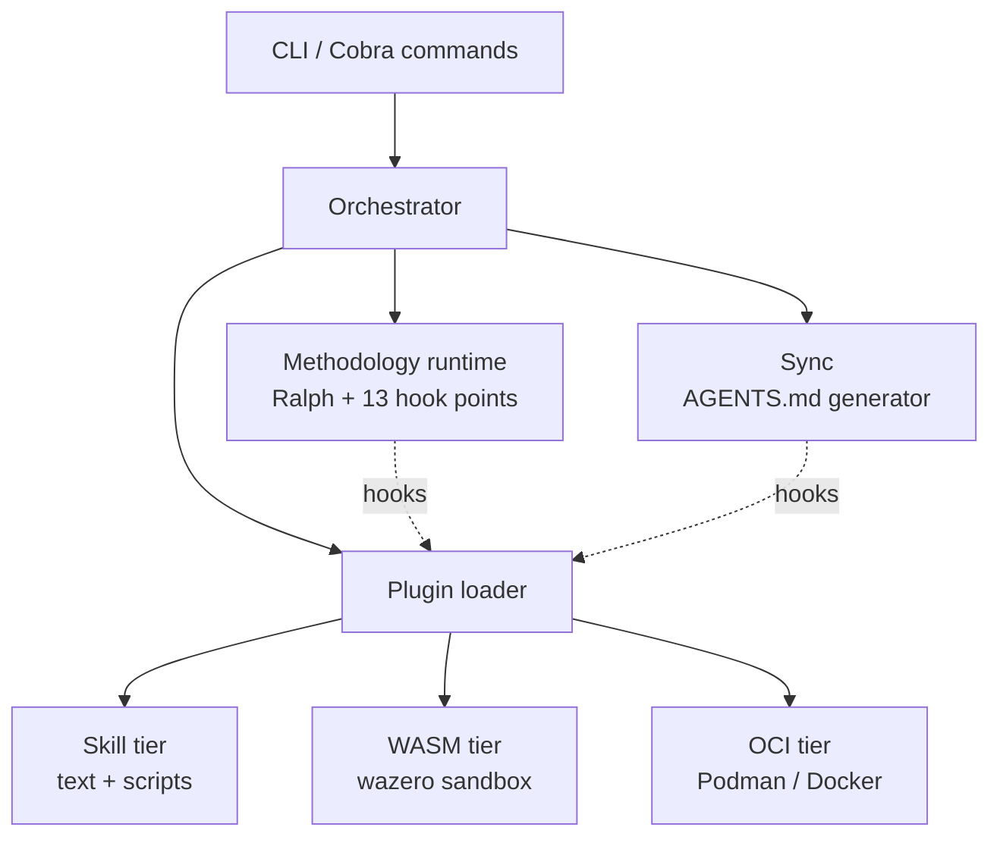

# Overview

Samuel v2 is built from five layers. Each layer is small, each is independently testable, and each exposes a public Go interface (under `internal/`, but stable as long as the v2 line lives).



## CLI

Cobra commands live under `internal/commands/`. Every command emits a `--json` envelope with the same `{ok, data, error}` shape so CI and other tools can parse them. The bare `samuel` invocation prints help with smart context detection (initialised vs uninitialised, plugins installed vs not). See [CLI reference](../reference/cli.md).

## Orchestrator

The orchestrator (`internal/orchestrator`) is the lifecycle engine. It installs plugins in declared order with LIFO rollback on failure, uninstalls in reverse, and replays the `samuel.lock` mutation log so uninstall doesn't need to re-detect what an install did. It owns the per-project advisory file lock (flock-based) — every state mutation goes through it.

## Plugin loader

The loader (`internal/plugin`) resolves plugins from registries, fetches them, verifies signatures via Sigstore, prompts for risky capabilities, and dispatches to the right tier. See [Plugins](plugins.md) for the tier model.

## Methodology runtime

The methodology runtime (`internal/methodology/ralph`) drives the autonomous loop: load PRD, render prompt, invoke agent, run quality checks, repeat. 13 hook points (`before:loop`, `iteration.gate`, `quality.check`, `before:agent.invoke`, …) let plugins extend the loop without forking it. See [Methodology](methodology.md).

## Sync

`samuel sync` (`internal/sync`) walks the project tree and writes per-folder `AGENTS.md` files generated from `samuel.toml`, the active PRD state, and the installed plugin set. The walker preserves user-customised sections via an autogen marker. Translator plugins hook `sync.after` to mirror AGENTS.md into tool-specific files. See [AGENTS.md](agents-md.md).

## Where things live on disk

```text
~/.samuel/
├── builtins/                 # embedded built-in skills, content-hash idempotent
├── cache/
│   ├── registries/<host>/    # 24h TTL, stale-cache fallback
│   ├── wasm-compiled/        # wazero compile cache
│   └── verify/               # signature-verify decisions, keyed by binary version
└── plugins/                  # globally installed plugins (rare; project-local is default)

<project>/
├── AGENTS.md                 # rendered from samuel.toml
├── samuel.toml               # canonical config
├── samuel.lock               # machine-managed mutation log
└── .samuel/
    ├── plugins/<name>/       # project-local installs
    ├── tasks/                # PRDs (markdown source)
    ├── run/                  # runtime state (TOON + MD)
    └── templates/            # optional user overrides
```
